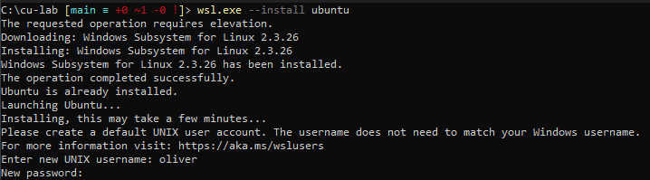

# cu-lab

## Setup

### System Requirements
10 GBs of free RAM (i know)
30 GBs of free space

### 1. Install WSL
To get started, please install [WSL](https://learn.microsoft.com/en-us/windows/wsl/install) by running the following commands:

```bash
wsl.exe --install ubuntu
wsl.exe --update
```

**Note:** You will be prompted to set a username and password. Once done, you can access Ubuntu by searching for "Ubuntu" in the Start menu.



---

### 2. Install Docker CE and QEMU-KVM

Run the following steps to ensure Docker CE and QEMU-KVM are properly installed:

```bash
# Remove older packages (if any)
sudo apt-get remove docker docker-engine docker.io containerd runc

# Install necessary pre-requisites
sudo apt-get update
sudo apt-get install \
  ca-certificates \
  curl \
  gnupg \
  lsb-release

# Add Docker apt key
sudo mkdir -p /etc/apt/keyrings
curl -fsSL https://download.docker.com/linux/ubuntu/gpg | sudo gpg --dearmor -o /etc/apt/keyrings/docker.gpg

# Add Docker apt repository
echo \
  "deb [arch=$(dpkg --print-architecture) signed-by=/etc/apt/keyrings/docker.gpg] https://download.docker.com/linux/ubuntu \
  $(lsb_release -cs) stable" | sudo tee /etc/apt/sources.list.d/docker.list > /dev/null

# Refresh apt repositories
sudo apt-get update

# Install Docker CE
sudo apt-get install docker-ce docker-ce-cli containerd.io docker-buildx-plugin docker-compose-plugin

# Install QEMU-KVM
sudo apt-get install qemu-kvm
```

#### Verify KVM support:
```bash
sudo kvm-ok
```

You should see:

```bash
INFO: /dev/kvm exists
KVM acceleration can be used
```

---

### 3. (Optional) Install SSH

If you want to connect remotely, install the SSH server:

```bash
sudo apt install openssh-server
```

To view your IP address:

```bash
ip a | grep "eth0"
```

To SSH from the host:

```bash
ssh username@192.YourIp
```

---

### 4. Clone the Repository

While still in WSL Ubuntu, clone the `cu-lab` repository:

```bash
cd ~/
mkdir cu-lab -m 777
git clone https://github.com/IsaiahDuarte/cu-lab.git
cd ~/cu-lab
```

You can open this directory in File Explorer by navigating to `\\wsl.localhost\Ubuntu\home\oliver\cu-lab`.

Rename `.env.example` to `.env`.

Open and modify the .ENV file to your needs. Like changing the username and password of the VMs

---

### 5. Prerequisites

Follow the guide [here](https://support.controlup.com/docs/create-your-controlup-organization) to create your ControlUp organization.

Once signed into DEX:

1. Start an **EdgeDX trial**.
2. While waiting for provisioning, download and extract the [RT-DX Console](https://www.controlup.com/download-center/?type=console).
3. Copy the `.exe` to the `MonitorSetup` folder. You can open Ubuntu's files through Explorer: `~/cu-lab/ControlUpConsole.exe`.
4. Rename `.env.example` to `.env` if you haven't already.
5. After EdgeDX provisioning is complete, go to the download section inside EdgeDX and copy the **Tenant Name** and **Device Registration Code** to the `.env` file.
6. Download the **Linux (x64) agent** and save it to `~/cu-lab/edge/debian/install/avaceesipagent-linux`.

---

### 6. Starting `cu-lab`

To start the lab, open Ubuntu and navigate to `~/cu-lab`. Then, run:

```bash
sudo docker compose up -d
```

At this point, you should see one device in EdgeDX and be able to access Windows Server and macOS using the following links:

- **Windows Server**: [http://localhost:8006](http://localhost:8006)
- **macOS**: [http://localhost:8007](http://localhost:8007)

---

#### Windows Server 2022 Setup

1. Connect to Windows Server using [http://localhost:8006](http://localhost:8006) and wait for the desktop to load (10-20 minutes).
2. Once on the desktop, you can RDP into it using the IP returned from Ubuntu:

    ```bash
    ip a | grep "eth0"
    ```

3. Copy the `monitorsetup` folder from the repo and paste it onto the desktop.
4. Open **Admin PowerShell** and run the following command:

    ```bash
    Set-ExecutionPolicy Bypass
    ```

5. Run this command to deploy:

    ```bash
    . "$ENV:USERPROFILE\Desktop\monitorsetup\deploy-ad.ps1"
    ```

   After this, you will be disconnected. Wait a few minutes, then reconnect the RDP session and repeat the step above. You will be prompted to set the **DSRM password** and reboot.
6. Run the script one more time to set the **NTP settings**.

---

### 7. RT-DX Environment Setup

- Run the `ControlUpConsole.exe` inside the `monitorsetup` folder and log in to DEX with your new organization.
- Deploy the monitor through the **monitor status**.

---

### 8. EdgeDX on Monitor

You can deploy EdgeDX on the same Windows server by following the steps in the download section inside DEX.

---

### 9. Scoutbees on Monitor

1. Start a free trial in DEX.
2. Create a **Custom Hive** by downloading the installation and following the guide.

---

### 10. SecureDX on Monitor

Start the trial and follow the steps to complete the setup.

---

### 11. macOS (Optional)

After the Windows Server setup, you can proceed with macOS to save resources.

Refer to the Repo Guide [here](https://github.com/dockur/macos?tab=readme-ov-file#faq-).

1. Connect to macOS using [http://localhost:8007](http://localhost:8007).
2. Open **Disk Utility**, select the largest Apple Inc. VirtIO Block Media disk, and click the **Erase** button to format the disk to **APFS**. Give it a recognizable name.
3. Close the window and proceed with the installation by selecting **Reinstall macOS**.
4. When prompted where to install, select the disk you just created.
5. Once installed, follow the setup and skip unnecessary services (like signing into Apple ID).
6. Launch **Safari** and go to [app.controlup.com](https://app.controlup.com) to sign in.
7. Download and install the **EdgeDX Agent**.

---

## Useful Commands / Tips
- sudo docker compose down - Stop and delete the containers/network
- sudo docker stop monitor - Stop the monitor container
- sudo docker compose up -d - Creates/Recreates docker containers and network
- C:\Users\%username%\AppData\Local\Packages\CanonicalGroupLimited.Ubuntu_79rhkp1fndgsc\LocalState - Is where WSL installs Distros

## Repositories Used

- [macOS Repo](https://github.com/dockur/macos)
- [Windows Repo](https://github.com/dockur/windows)

---

## License

This project is licensed under the [MIT License](https://choosealicense.com/licenses/mit/).