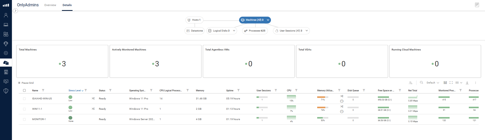
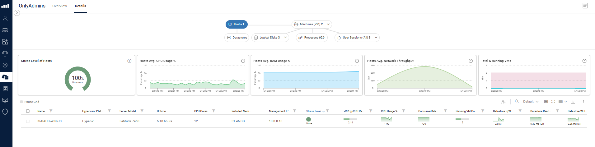

# cu-lab

### Summary
This repository leverages [AutomatedLab](https://github.com/AutomatedLab/AutomatedLab) to easily configure a ControlUp environment on Hyper-V. The lab structure is defined via a JSON configuration file.

For quick setup, please refer to the [Quick Start](#quick-start) section.

### Requirements
To set up a full CU Lab, you will need the following:
- **ControlUp Organization** - See [Create Your ControlUp Organization](https://support.controlup.com/docs/create-your-controlup-organization)
- **[Hyper-V](https://learn.microsoft.com/en-us/virtualization/hyper-v-on-windows/reference/hyper-v-requirements)**
- **DEX API Key** - See [Create and Manage API Keys](https://api.controlup.io/reference/how-to-create-api-keys)
- Depending on the lab configuration, you will need:
  - **[Windows Server](https://www.microsoft.com/evalcenter/download-windows-server-2022)**
  - **[Windows 11](https://www.microsoft.com/en-us/software-download/windows11)**
- A valid lab configuration JSON file.
- **ControlUp [Console](https://www.controlup.com/download-center/)**
- **EdgeDX Agent Manager [MSI](https://support.controlup.com/docs/edge-dx-agent-installation#download-and-install-the-edge-dx-agent)**
- **Scoutbees [Custom Hive](https://support.controlup.com/docs/installing-custom-hives#install-a-custom-hive)**

### JSON Configuration
`New-CULab.ps1` dynamically adds machines to your lab based on the provided JSON configuration file.

Example configurations:
This is an example configuration file for a lab with 1 Server (Monitor) and 1 Client (RT-Agent, Scoutbees, EdgeDX)
```json
{
    "Description": "This is an example configuration file for a lab with 1 Server (Monitor) and 1 Client (RT-Agent, Scoutbees, EdgeDX)",
    "LabName": "MacroPlusLab-02",
    "OrgName": "",
    "DriveLetter": "C",
    "DEXKey": "",
    "DEVREGCODE": "",
    "TENANT": "",
    "Domains": [
        {
            "Name": "macroplus.internal",
            "Username": "Administrator",
            "Password": "MySecurePassword123!"
        }
    ],
    "VirtualMachines": [
        {
            "Name": "monitor-1",
            "OS": "Windows Server 2022 Standard Evaluation (Desktop Experience)",
            "RAM": "4294967296",
            "CPU": "1",
            "DomainName": "macroplus.internal",
            "Roles": ["RootDC", "Routing"],
            "RTDX": true,
            "EdgeDX": false,
            "Hive": false,
            "Monitor": true
        },
        {
            "Name": "win11-1",
            "OS": "Windows 11 Pro",
            "RAM": "2147483648",
            "CPU": "1",
            "DomainName": "macroplus.internal",
            "Roles": [],
            "RTDX": true,
            "EdgeDX": true,
            "Hive": true,
            "Monitor": false
        }
    ]
}
```
This is an example configuration file for a lab with 1 DC, 1 monitor, 1 Hive, 1 EdgeDX device on the same Server
```json
{
    "Description": "This is an example configuration file for a lab with 1 DC, 1 monitor, 1 Hive, 1 EdgeDX device on the same Server",
    "LabName": "MacroCULab",
    "OrgName": "",
    "DriveLetter": "C",
    "DEXKey": "",
    "DEVREGCODE": "",
    "TENANT": "",
    "Domains": [
        {
            "Name": "macroculab.internal",
            "Username": "Administrator",
            "Password": "MySecurePassword123!"
        }
    ],
    "VirtualMachines": [
        {
            "Name": "monitor",
            "OS": "Windows Server 2022 Standard Evaluation (Desktop Experience)",
            "RAM": "4294967296",
            "CPU": "2",
            "DomainName": "macroculab.internal",
            "Roles": [ "RootDC", "Routing" ],
            "RTDX": true,
            "EdgeDX": true,
            "Hive": true,
            "Monitor": true
        }
    ]
}
```

### Root Properties:
- **Description**: Optional but provides a brief description of the lab.
- **LabName**: Identifies the lab, creates separate network adapters, etc.
- **OrgName**: Your RTDX Organization name (case-sensitive).
- **DriveLetter**: Specifies the drive for storing VMs and LabSources folder.
- **DEXKey**: See [Create and Manage API Keys](https://api.controlup.io/reference/how-to-create-api-keys).
- **DEVREGCODE**: See [EdgeDX Agent](https://support.controlup.com/docs/edge-dx-agent-installation#download-and-install-the-edge-dx-agent).
- **TENANT**: See [EdgeDX Agent](https://support.controlup.com/docs/edge-dx-agent-installation#download-and-install-the-edge-dx-agent).
- **Domains**: Array of domains in the lab
- **VirtualMachines**: Array of virtual machines to be created.

### Virtual Machines Properties:
- **Name**: Hostname of the VM.
- **OS**: Retrieved from AutomatedLab - [Get-LabAvailableOperatingSystem](https://automatedlab.org/en/latest/AutomatedLabCore/en-us/Get-LabAvailableOperatingSystem/).
- **RAM**: RAM assigned to the VM (in bytes).
- **CPU**: CPU count assigned to the VM.
- **DomainName**: New domain name.
- **Roles**: Read more about roles [here](https://automatedlab.org/en/latest/Wiki/Roles/roles/).
- **RTDX**: If true, installs the RTDX Agent via self-registration.
- **EdgeDX**: If true, installs the EdgeDX Agent with configuration properties.
- **Hive**: If true, installs the Scoutbees Custom Hive software.
- **Monitor**: If true, installs ControlUp Monitor using ControlUp.Automation.

### Domain Properties:
- **Name**: Name of the new domain
- **Username**: Specifies the username of the domain admin
- **Password**: Specifies the password of the domain admin

**Note:** The script assumes a routing role is included in the configuration.
**Note:** The RootDC VM has to be at the start of the VM array
**Note:** Currently only one domain is supported.

More examples can be found in [ConfigExamples](ConfigExamples)

### Quick Start

To quickly set up a lab with Windows Server 2022, Windows 11 agent, RTDX, EdgeDX, Scoutbees, and Active Directory, follow these steps:

1. Download the repository.
2. Copy `./ConfigExamples/MacroPlusCULab.json` to the root of the repo.
3. Update the JSON file:
   - Set values for `DEXKey`, `DEVREGCODE`, `TENANT`.
   - Replace the `DomainName` for each VM with your desired domain name.
4. If you don't have Hyper-V installed, run the following command in an elevated PowerShell window:  
   `Enable-WindowsOptionalFeature -FeatureName 'Microsoft-Hyper-V' -Online -All` and reboot.
5. Download Windows 11 from [Microsoft](https://www.microsoft.com/en-us/software-download/windows11).
6. Download Windows Server 2022 from [Microsoft](https://www.microsoft.com/evalcenter/download-windows-server-2022).
7. Download the ControlUp Console from [ControlUp](https://www.controlup.com/download-center/).
8. Download the EdgeDX Agent Manager MSI from your [tenant](https://support.controlup.com/docs/edge-dx-agent-installation#download-and-install-the-edge-dx-agent).
9. Download the Scoutbees Custom Hive from your [ControlUp dashboard](https://support.controlup.com/docs/installing-custom-hives#install-a-custom-hive).
10. Open an elevated PowerShell window, navigate to the repository folder, and run:  
    `. ./New-CULab.ps1 -ConfigPath ./MacroPlusCULab.json`

**Note:** The setup may take up to an hour depending on your device. It will be faster for new labs since the OS images are built.

Once the script is done, you should have entries in your host file for the new VMs. So you can RDP into them or open Hyper-V Manager and connect to them that way.



To add the host and hyperv connection:
1. Add the host ip and name to the hostfile on the monitor, example: `192.168.12.1 ISAIAHD-WIN-US`
2. Manually install the CUAgent and set the inbound registry key `Set-ItemProperty -Path "HKLM:\SOFTWARE\Smart-X\ControlUp\Agent\Communication" -Name "Outbound" -Value 0`
3. Restart the Agent
4. Launch the console on the monitor
5. Add the host by name to the org tree
6. Check the monitor data sources for the connection. Should be available in DEX



For more information, see the [AutomatedLab documentation](https://automatedlab.org/).

### Upcoming
- Multi-Domain support
- Versioning for CU Products
- Validation of the Config file

### References

- [Learn about Controlup](https://www.controlup.com/)
- [AutomatedLab Documentation](https://automatedlab.org/)
- [ControlUp Console Download](https://www.controlup.com/download-center/)
- [EdgeDX Agent Installation](https://support.controlup.com/docs/edge-dx-agent-installation)
- [Scoutbees Custom Hive Installation](https://support.controlup.com/docs/installing-custom-hives#install-a-custom-hive)
- [Hyper-V Requirements](https://learn.microsoft.com/en-us/virtualization/hyper-v-on-windows/reference/hyper-v-requirements)